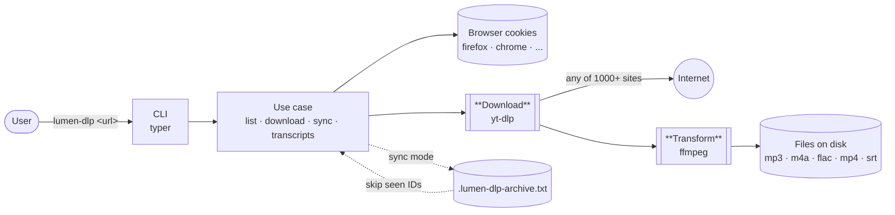

# lumen-dlp

> **Download anything, from anywhere. Sync your YouTube Music library on autopilot.**

A no-nonsense CLI for grabbing media off the internet — YouTube, X, TikTok, Instagram, and the [1000+ sites](https://github.com/yt-dlp/yt-dlp/blob/master/supportedsites.md) that [yt-dlp](https://github.com/yt-dlp/yt-dlp) supports — with [ffmpeg](https://ffmpeg.org/) doing the heavy lifting on formats. Plus a killer YouTube Music sync mode that mirrors your private playlists (Liked Music included) to disk.

```bash
# Grab a video from anywhere
lumen-dlp download "https://www.tiktok.com/@user/video/123"

# Mirror your Liked Music. Run weekly. Only new tracks download.
lumen-dlp sync -o ./music -a mp3 -q 0 -j 8
```

---

## How it works

A URL goes in, a tagged file lands on disk. Two stages do the work: **Download** (yt-dlp pulls bytes from whatever site you threw at it) and **Transform** (ffmpeg re-muxes, transcodes, and embeds metadata + cover art).



---

## Why lumen-dlp

There are a hundred yt-dlp wrappers. Most of them stop being useful the moment you want to:

- **Pull from any site, in any format.** YouTube, X (Twitter), TikTok, Instagram, Twitch, Vimeo, SoundCloud, Bandcamp... if yt-dlp supports it, lumen-dlp downloads it.
- **Access your private playlists.** lumen-dlp reads cookies straight from your browser — no manual `cookies.txt` exports, no re-login hassle. YouTube Music's Liked Music works out of the box.
- **Keep a library in sync, not re-download it.** `sync` maintains an archive file: re-run it tomorrow, next week, or from cron, and only new items come down. Think `rsync` for media.
- **Get files that don't look like garbage in your player.** Cover art and full metadata (title, artist, album) are embedded by default. No post-processing scripts.
- **Pick the format you actually want.** MP3 (VBR or CBR), M4A (no re-encoding — straight AAC out of YouTube), FLAC, OPUS, video MP4/MKV/WebM. Cap resolution if you need to.
- **Go fast.** `-j 8` runs eight downloads in parallel. A 500-item playlist finishes while you grab coffee.
- **Pull transcripts too.** Subtitles, lyrics tracks, auto-generated captions — single video or whole playlist, multiple languages.

Built for people who'd rather own their media than rent access to it.

---

## Quick start

```bash
# 1. Install
uv tool install git+https://github.com/luis-codex/lumen-dlp

# 2. (Optional) Tell it which browser holds your YouTube Music session
$env:LUMEN_DLP_BROWSER = "firefox"   # PowerShell
# export LUMEN_DLP_BROWSER=firefox   # bash/zsh

# 3. Download anything
lumen-dlp download "https://youtu.be/<id>"
lumen-dlp download "https://www.tiktok.com/@user/video/123"
lumen-dlp download "https://x.com/user/status/123"

# 4. Or mirror your Liked Music in MP3 320kbps with covers + metadata
lumen-dlp sync -o ./music -a mp3 -q 0 -j 8

# A week later, run the exact same command. Only new songs download.
lumen-dlp sync -o ./music -a mp3 -q 0 -j 8
```

---

## Installation

Requires Python ≥ 3.14 (provisioned automatically by `uv`) and [`ffmpeg`](https://ffmpeg.org/) on your `PATH`.

```bash
# From GitHub (recommended)
uv tool install git+https://github.com/luis-codex/lumen-dlp

# Or from a local clone
git clone https://github.com/luis-codex/lumen-dlp
cd lumen-dlp
uv tool install .
```

Once installed, `lumen-dlp` is available globally:

```bash
lumen-dlp --help
```

To upgrade:

```bash
uv tool install git+https://github.com/luis-codex/lumen-dlp --reinstall
```

## Configure cookies

Some sites — YouTube Music in particular — need your cookies to access private content (Liked Music, Library, age-restricted videos, etc.). `lumen-dlp` reads them straight from your browser — no exports, no manual files.

```bash
# Firefox (recommended on Windows)
lumen-dlp --browser firefox list

# Others: chrome, brave, edge, opera, vivaldi, safari, chromium...
lumen-dlp --browser chrome list
```

If you use a Firefox fork (Zen, Waterfox, LibreWolf) or a custom profile, pass the path explicitly:

```bash
lumen-dlp --browser firefox --profile "C:\Users\<you>\AppData\Roaming\zen\Profiles\xxxx.Default" list
```

Or configure it once via environment variables:

| Variable                        | Default     | Example                                                                  |
| ------------------------------- | ----------- | ------------------------------------------------------------------------ |
| `LUMEN_DLP_BROWSER`             | `firefox`   | `chrome`                                                                 |
| `LUMEN_DLP_BROWSER_PROFILE`     | *(empty)*   | `C:\Users\you\AppData\Roaming\zen\Profiles\xxxx.Default (release)`       |

**Windows (PowerShell)** — for the current session:

```powershell
$env:LUMEN_DLP_BROWSER = "firefox"
$env:LUMEN_DLP_BROWSER_PROFILE = "C:\Users\you\AppData\Roaming\zen\Profiles\xxxx.Default (release)"
```

To persist them across reboots (recommended), set them as User variables and open a **new** terminal:

```powershell
[Environment]::SetEnvironmentVariable("LUMEN_DLP_BROWSER", "firefox", "User")
[Environment]::SetEnvironmentVariable("LUMEN_DLP_BROWSER_PROFILE", "C:\Users\you\AppData\Roaming\zen\Profiles\xxxx.Default (release)", "User")
```

Alternative GUI: `Win + R` → `sysdm.cpl` → *Advanced* → *Environment Variables…* → add under *User variables*.

**macOS / Linux (bash/zsh)** — add to `~/.bashrc` or `~/.zshrc`:

```bash
export LUMEN_DLP_BROWSER=firefox
export LUMEN_DLP_BROWSER_PROFILE="$HOME/.mozilla/firefox/xxxx.default-release"
```

> ⚠️ **Windows + Chromium (Chrome/Brave/Edge):** since 2024 these browsers use **Application-Bound Encryption** and `yt-dlp` cannot decrypt their cookies ([yt-dlp#10927](https://github.com/yt-dlp/yt-dlp/issues/10927)). Use Firefox/Zen or export a `cookies.txt` manually.

## Commands

```bash
lumen-dlp --help
```

### `list` — list playlist songs

```bash
# Your YouTube Music Liked Music (default)
lumen-dlp list

# Another playlist
lumen-dlp list "https://music.youtube.com/playlist?list=PLxxxx"
```

### `download` — download audio or video

Downloads a video or full playlist in the chosen format. Works with any yt-dlp-supported site. Cover art and metadata are embedded by default.

```bash
# Default: M4A audio (no re-encoding, preserves the original AAC)
lumen-dlp download "https://youtu.be/<id>"

# From TikTok, X, Instagram, etc.
lumen-dlp download "https://www.tiktok.com/@user/video/123"
lumen-dlp download "https://x.com/user/status/123"

# No URL → falls back to your YouTube Music Liked Music
lumen-dlp download

# MP3 at 192 kbps
lumen-dlp download "<url>" -a mp3 -q 192

# FLAC (lossless)
lumen-dlp download "<url>" -a flac

# Video MP4 capped at 1080p
lumen-dlp download "<url>" -t video -v mp4 --max-height 1080

# Full playlist into a specific folder
lumen-dlp download "https://music.youtube.com/playlist?list=PLxxxx" -o ./music

# Parallel — bulk-download a playlist with 8 workers
lumen-dlp download "<playlist-url>" -j 8

# Skip cover art and metadata
lumen-dlp download "<url>" --no-thumbnail --no-metadata
```

| Option                 | Default     | Description                                         |
| ---------------------- | ----------- | --------------------------------------------------- |
| `-t`/`--type`          | `audio`     | `audio` or `video`                                  |
| `-a`/`--audio-format`  | `m4a`       | `mp3`, `m4a`, `opus`, `flac`, `wav`, `vorbis`       |
| `-v`/`--video-format`  | `mp4`       | `mp4`, `mkv`, `webm`                                |
| `-q`/`--quality`       | `0`         | Audio: `0` best → `9` worst, or kbps (`192`)        |
| `--max-height`         | uncapped    | Cap video resolution (`1080`, `720`...)             |
| `-o`/`--output`        | `downloads` | Output directory                                    |
| `--thumbnail`          | on          | Embed cover art                                     |
| `--metadata`           | on          | Embed metadata (title, artist...)                   |
| `-j`/`--concurrent`    | `1`         | Parallel workers for playlists (4–8 = much faster)  |

### `sync` — only what's new

Like `download`, but it keeps a **record file** with the IDs already downloaded. Re-run it to fetch only what's new. Pair it with `cron` / Task Scheduler and forget about it.

```bash
# Keep your Liked Music in sync
lumen-dlp sync

# Another playlist, with 8 parallel workers
lumen-dlp sync "https://music.youtube.com/playlist?list=PLxxxx" -o ./music -a mp3 -j 8

# Custom archive file
lumen-dlp sync "<url>" --archive ./state/seen.txt
```

| Option       | Default                              | Description                                |
| ------------ | ------------------------------------ | ------------------------------------------ |
| `--archive`  | `<output>/.lumen-dlp-archive.txt`    | File tracking already-downloaded IDs       |

> Also accepts every `download` flag.

**Maintenance tips:**

| Goal                                      | How                                                              |
| ----------------------------------------- | ---------------------------------------------------------------- |
| Re-download a track you deleted           | Remove its line from `.lumen-dlp-archive.txt`, then `sync` again |
| Force a full re-sync                      | Delete `.lumen-dlp-archive.txt` and re-run                       |
| Run it daily on Windows                   | `schtasks /create /sc DAILY /tn lumen-dlp-sync /tr "lumen-dlp sync …"` |
| Run it daily on macOS/Linux               | Add `lumen-dlp sync …` to your crontab                           |

### `transcripts` — download subtitles / lyrics

Pulls the available subtitles (manual and auto-generated) from a video or full playlist.

```bash
# A single video
lumen-dlp transcripts "https://youtu.be/<id>"

# Full playlist to a different folder
lumen-dlp transcripts "https://music.youtube.com/playlist?list=LM" -o ./subs

# Spanish only, no auto-generated, VTT format
lumen-dlp transcripts "<url>" -l es --no-auto -f vtt

# Multiple languages (repeat -l)
lumen-dlp transcripts "<url>" -l es -l en -l pt
```

| Option          | Default                              | Description                                  |
| --------------- | ------------------------------------ | -------------------------------------------- |
| `-o`/`--output` | `transcripts`                        | Output directory                             |
| `-l`/`--lang`   | `es`, `en`                           | Languages to try (repeatable)                |
| `--auto`        | on                                   | Include auto-generated subtitles             |
| `-f`/`--format` | `srt`                                | `srt`, `vtt`, `ass`, `lrc`                   |
| `--archive`     | `<output>/.lumen-dlp-archive.txt`    | Re-runnable: skips already-fetched items     |
| `-j`/`--concurrent` | `1`                              | Parallel workers for playlists               |

## Development

```bash
git clone https://github.com/luis-codex/lumen-dlp
cd lumen-dlp
uv sync

# Editable install (changes in source reflect instantly)
uv tool install -e .

# Lint and format
uv run ruff check . --fix
uv run ruff format .
```

## License

MIT
