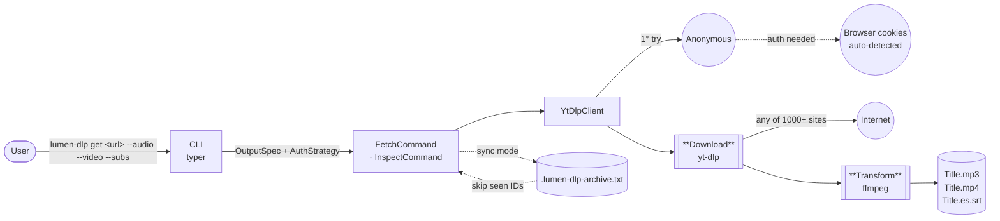

# lumen-dlp

> **Download anything, from anywhere. Sync your YouTube Music library on autopilot.**

A no-nonsense CLI for grabbing media off the internet — YouTube, X, TikTok, Instagram, and the [1000+ sites](https://github.com/yt-dlp/yt-dlp/blob/master/supportedsites.md) that [yt-dlp](https://github.com/yt-dlp/yt-dlp) supports — with [ffmpeg](https://ffmpeg.org/) doing the heavy lifting on formats. You pick what you want (audio, video, subs, or all at once), in whatever format, and it just works. Cookies are handled automatically: anonymous when the site is public, your browser's session when it isn't.

```bash
# Grab a TikTok — no auth, no config
lumen-dlp get "https://www.tiktok.com/@user/video/123" --audio -a mp3

# A YouTube video with audio, video, and subtitles in one shot
lumen-dlp get "https://youtu.be/<id>" --all

# Mirror your Liked Music. Run it weekly. Only new tracks download.
lumen-dlp sync -o ./music -a mp3 -q 0 -j 8
```

---

## How it works

A URL goes in, the file(s) you asked for land on disk. Two stages do the work: **Download** (yt-dlp pulls bytes from whatever site you threw at it) and **Transform** (ffmpeg re-muxes, transcodes, embeds metadata + cover art). Auth is invisible — anonymous first, browser cookies on demand.



Audio, video and subs are produced from a **single yt-dlp invocation per URL** — one network pass, ffmpeg postprocessing handles the rest locally.

---

## Why lumen-dlp

There are a hundred yt-dlp wrappers. Most stop being useful the moment you want to:

- **Pull from any site, in any combo.** Audio, video, subtitles — or all three from the same URL in one command. YouTube, X (Twitter), TikTok, Instagram, Twitch, Vimeo, SoundCloud, Bandcamp... if yt-dlp supports it, lumen-dlp grabs it.
- **Stop thinking about auth.** Try anonymous; on a login-required error, retry transparently with cookies from your browser (auto-detected — Firefox, Chrome, Brave, Edge, Vivaldi). Your YouTube Music Liked Music, your private X bookmarks, your saved Instagram posts — work without exports or `cookies.txt`.
- **Keep a library in sync, not re-download it.** `sync` maintains an archive file: re-run from cron / Task Scheduler and only new items come down. Think `rsync` for media.
- **Get files that don't look like garbage in your player.** Cover art and full metadata (title, artist, album) are embedded by default. No post-processing scripts.
- **Pick the format you actually want.** MP3 (VBR or CBR), M4A (no re-encoding — straight AAC out of YouTube), FLAC, OPUS, video MP4/MKV/WebM. Cap resolution if you need to. Subs in SRT/VTT/ASS/LRC.
- **Go fast.** `-j 8` runs eight downloads in parallel. A 500-item playlist finishes while you grab coffee.

Built for people who'd rather own their media than rent access to it.

---

## Quick start

```bash
# 1. Install
uv tool install git+https://github.com/luis-codex/lumen-dlp

# 2. Download anything — no config required
lumen-dlp get "https://www.tiktok.com/@user/video/123" --audio -a mp3
lumen-dlp get "https://youtu.be/<id>" --video --max-height 1080
lumen-dlp get "https://x.com/user/status/123" --all

# 3. Mirror your Liked Music in MP3 320kbps with covers + metadata
lumen-dlp sync -o ./music -a mp3 -q 0 -j 8

# A week later, same command. Only new songs download.
lumen-dlp sync -o ./music -a mp3 -q 0 -j 8
```

For private/age-restricted content, the first failed attempt triggers a transparent retry using cookies from your logged-in browser. You don't have to do anything — just stay logged in where you normally are.

---

## Installation

Requires Python ≥ 3.14 (provisioned automatically by `uv`) and [`ffmpeg`](https://ffmpeg.org/) on your `PATH`.

```bash
# From GitHub (recommended)
uv tool install git+https://github.com/luis-codex/lumen-dlp

# Or from a local clone
git clone https://github.com/luis-codex/lumen-dlp
cd lumen-dlp
uv tool install .
```

To upgrade:

```bash
uv tool install git+https://github.com/luis-codex/lumen-dlp --reinstall
```

---

## Commands

```bash
lumen-dlp --help
```

Three verbs: `get` (one-shot), `sync` (incremental + archive), `list` (inspect a URL without downloading).

### `get` — download one URL

Compose what you want with `--audio`, `--video`, `--subs`, or `--all`. With no flag at all, defaults to audio M4A.

```bash
# Default: audio M4A
lumen-dlp get "https://youtu.be/<id>"

# Multi-platform — same command shape
lumen-dlp get "https://www.tiktok.com/@user/video/123" --audio
lumen-dlp get "https://x.com/user/status/123" --video

# Choose format and quality
lumen-dlp get "<url>" --audio -a mp3 -q 320
lumen-dlp get "<url>" --audio -a flac
lumen-dlp get "<url>" --video -v mp4 --max-height 1080

# Combine outputs — one network pass, multiple files
lumen-dlp get "<url>" --audio -a mp3 --video --subs
lumen-dlp get "<url>" --all                     # shortcut for audio + video + subs

# Subtitles in chosen langs (default = all available)
lumen-dlp get "<url>" --subs -l es,en,pt
lumen-dlp get "<url>" --subs --subs-format vtt --no-auto

# Playlists — parallel
lumen-dlp get "https://music.youtube.com/playlist?list=PLxxxx" --audio -a mp3 -j 8

# Strip thumbnail / metadata if you don't want them embedded
lumen-dlp get "<url>" --audio --no-thumbnail --no-metadata
```

| Flag                  | Default     | Description                                         |
| --------------------- | ----------- | --------------------------------------------------- |
| `--audio`             | (implicit when no flag) | Request audio                              |
| `-a`/`--audio-format` | `m4a`       | `mp3`, `m4a`, `opus`, `flac`, `wav`, `vorbis`       |
| `-q`/`--quality`      | `0`         | Audio: `0` best → `9` worst, or kbps (`192`, `320`) |
| `--video`             | off         | Request video                                       |
| `-v`/`--video-format` | `mp4`       | `mp4`, `mkv`, `webm`                                |
| `--max-height`        | uncapped    | Cap video resolution (`1080`, `720`...)             |
| `--subs`              | off         | Request subtitles                                   |
| `--subs-format`       | `srt`       | `srt`, `vtt`, `ass`, `lrc`                          |
| `-l`/`--lang`         | *all available* | Comma-separated langs (`es,en,pt`)              |
| `--no-auto`           | off         | Exclude auto-generated subtitles                    |
| `--all`               | off         | Shortcut for `--audio --video --subs`               |
| `-o`/`--output`       | `downloads` | Output directory                                    |
| `--no-thumbnail`      | (embed on)  | Skip embedding cover art                            |
| `--no-metadata`       | (embed on)  | Skip embedding title/artist tags                    |
| `-j`/`--concurrent`   | `1`         | Parallel workers for playlists (4–8 = much faster)  |
| `--browser`           | auto        | Force cookies from a specific browser               |
| `--profile`           | —           | Browser profile path (for Firefox forks)            |
| `--no-cookies`        | off         | Never use cookies, even on auth-needed errors       |

### `sync` — incremental download

Same flags as `get`, plus `--archive`. Maintains a record file of downloaded IDs; re-running only fetches new items. Pair with `cron` / Task Scheduler.

```bash
# Keep your Liked Music in sync
lumen-dlp sync

# Another playlist, 8 parallel workers
lumen-dlp sync "https://music.youtube.com/playlist?list=PLxxxx" --audio -a mp3 -j 8

# Custom archive location
lumen-dlp sync "<url>" --audio --archive ./state/seen.txt
```

| Flag        | Default                              | Description                                |
| ----------- | ------------------------------------ | ------------------------------------------ |
| `--archive` | `<output>/.lumen-dlp-archive.txt`    | File tracking already-downloaded IDs       |

> Accepts every `get` flag too.

**Maintenance tips:**

| Goal                                      | How                                                                |
| ----------------------------------------- | ------------------------------------------------------------------ |
| Re-download an item you deleted           | Remove its line from `.lumen-dlp-archive.txt`, then `sync` again   |
| Force a full re-sync                      | Delete `.lumen-dlp-archive.txt` and re-run                         |
| Run daily on Windows                      | `schtasks /create /sc DAILY /tn lumen-dlp-sync /tr "lumen-dlp sync …"` |
| Run daily on macOS/Linux                  | Add `lumen-dlp sync …` to your crontab                             |

### `list` — inspect without downloading

```bash
# Single video → title, duration, available subtitles per language
lumen-dlp list "https://youtu.be/<id>"

# Playlist → track list (titles, artists, durations)
lumen-dlp list "https://music.youtube.com/playlist?list=PLxxxx"
```

Use this when you want to know *what's there* before deciding which formats / langs to grab.

---

## Auth: how it actually works

You shouldn't need to read this section. The defaults are correct.

By default, `lumen-dlp` tries to download anonymously. If the site responds with "login required" (or similar), it auto-detects an installed browser on your system (priority: **firefox → chrome → brave → edge → vivaldi**) and retries using that browser's cookies. If cookies in the first browser don't authorize either, you get a clear error message pointing to `--browser <other>`.

**You'll only need to think about it when:**

- You're logged into the site in a non-default browser → set `--browser <name>` (or `LUMEN_DLP_BROWSER` env var to persist).
- You're using a Firefox fork (Zen, Waterfox, LibreWolf) → `--browser firefox --profile "<path-to-profile>"`.
- You don't want cookies under any circumstances → `--no-cookies`.
- You want to skip the anonymous-first round trip (e.g. for `sync` of a known-private playlist) → set `LUMEN_DLP_BROWSER` or pass `--browser`.

```bash
# Force a specific browser
lumen-dlp get "<url>" --browser chrome

# Firefox fork (Zen) with explicit profile
lumen-dlp get "<url>" --browser firefox --profile "C:\Users\<you>\AppData\Roaming\zen\Profiles\xxxx.Default"

# Skip cookies entirely
lumen-dlp get "<url>" --no-cookies
```

**Env vars (optional)** — useful for `sync` workflows where you already know cookies are needed and want to skip the anonymous probe each run.

| Variable                    | Effect                                                         |
| --------------------------- | -------------------------------------------------------------- |
| `LUMEN_DLP_BROWSER`         | Sets the default `--browser`. Skips the anonymous probe.       |
| `LUMEN_DLP_BROWSER_PROFILE` | Sets the default `--profile` (path).                           |

```powershell
# Windows (PowerShell) — persistent
[Environment]::SetEnvironmentVariable("LUMEN_DLP_BROWSER", "firefox", "User")
```

```bash
# macOS / Linux
export LUMEN_DLP_BROWSER=firefox
```

> ⚠️ **Windows + Chromium (Chrome/Brave/Edge):** since 2024 these browsers use Application-Bound Encryption and `yt-dlp` cannot decrypt their cookies on Windows ([yt-dlp#10927](https://github.com/yt-dlp/yt-dlp/issues/10927)). Use Firefox or export a `cookies.txt` manually.

---

## Development

```bash
git clone https://github.com/luis-codex/lumen-dlp
cd lumen-dlp
uv sync

# Editable install (changes reflect instantly)
uv tool install -e .

# Lint and format
uv run ruff check . --fix
uv run ruff format .
```

## License

MIT
